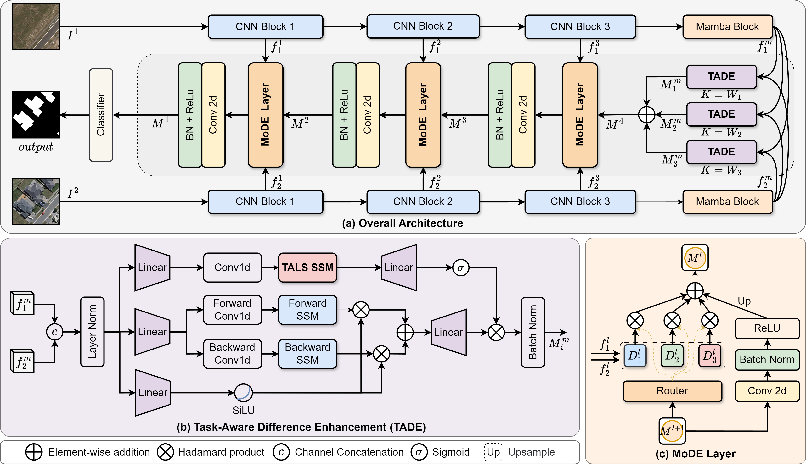

# TALS-CD: Causal Continuity-Based Task-Aware Mamba for Remote Sensing Binary Change Detection

[](https://ieeexplore.ieee.org/document/11527327)

Official implementation of "TALS-CD: Causal Continuity-Based Task-Aware Mamba for Remote Sensing Binary Change Detection", published in *IEEE Transactions on Geoscience and Remote Sensing (TGRS)*.

Paper: [IEEE Xplore](https://ieeexplore.ieee.org/document/11527327)

---

## Model Architecture



The architecture follows a gist-to-detail paradigm: a MobileNetV3 + Vim hybrid encoder extracts multi-scale features, and a Mixture of Difference Experts (MoDE) decoder aggregates difference representations for binary change prediction.

---

## Environment Setup

**Requirements:**

- Python 3.9
- PyTorch 1.13.1 + CUDA 11.7
- CUDA-compatible GPU

> **Important**: Only PyTorch 1.13.1 has been verified to train stably. Using other versions may cause gradient explosion and numerical overflow due to the custom Mamba CUDA kernels. Cause currently unknown.

**1. Install PyTorch 1.13.1**

```bash
conda install pytorch==1.13.1 torchvision==0.14.1 torchaudio==0.13.1 pytorch-cuda=11.7 -c pytorch -c nvidia
```

**2. Install Mamba**

The Mamba SSM used in this project comes from [Vim](https://github.com/hustvl/Vim). Vim does not provide a pre-built wheel for PyTorch 1.13.1, please download the source code from [Vim](https://github.com/hustvl/Vim) and compile it yourself.

**3. Install remaining dependencies**

```bash
pip install transformers==4.35.2
pip install numpy==1.26.0
pip install tensorboardX
pip install timm
pip install einops
pip install Pillow tqdm pyyaml
```

---

## Pretrained Weights and Checkpoints

Pretrained encoder weights, checkpoints, and training logs are available on [Baidu Netdisk](https://pan.baidu.com/s/1AWp1r0-Nz7ZWBLwD_R-HAA?pwd=h9h4). After downloading, place pretrained weights in `pretrain/` and checkpoints in `checkpoints/`.

---

## Dataset Preparation

This project supports three public change detection datasets. Organize each dataset in the following structure:

```
<dataset_root>/
├── train/
│   ├── A/          # pre-change images
│   ├── B/          # post-change images
│   └── label/      # binary change masks (0=unchanged, 255=changed)
├── val/
│   ├── A/
│   ├── B/
│   └── label/
└── test/
    ├── A/
    ├── B/
    └── label/
```

Update the `dataset_root` variable at the top of the corresponding dataloader file:

| Dataset   | Dataloader file                  | Download                                                             |
|-----------|----------------------------------|----------------------------------------------------------------------|
| LEVIR-CD  | `datasets/Levir_CD_smallcrop.py` | [LEVIR-CD](https://justchenhao.github.io/LEVIR/)                   |
| WHU-CD    | `datasets/WHU_CD.py`             | [WHU-CD](http://gpcv.whu.edu.cn/data/building_dataset.html)         |
| CLCD      | `datasets/CLCD.py`               | [CLCD](https://github.com/liumency/CropLand-CD)                     |

---

## Training

```bash
python train.py -m models.TALS_CD -d LEVIR -g 0
```

Change `-d LEVIR` to `WHU` or `CLCD` for other datasets. Use `--multi-gpu 0,1` for multi-GPU training and `--load-path <path>` to resume from a checkpoint.

---

## Evaluation

Edit `eval.py` to set the correct dataset dataloader import and checkpoint path, then run:

```bash
python eval.py
```

The script reports Accuracy, Precision, Recall, F1, and IoU on the test set. Optionally, uncomment the visualization block to save binary prediction masks and color-coded error maps (TP/TN/FP/FN).

---

## Citation

If you find this work useful, please cite:

```bibtex
@ARTICLE{11527327,
  author={Wang, Leiquan and Xu, Lifa and Luo, Chunbo and Wu, Chunlei},
  journal={IEEE Transactions on Geoscience and Remote Sensing}, 
  title={TALS-CD: Causal Continuity-Based Task-Aware Mamba for Remote Sensing Binary Change Detection}, 
  year={2026},
  volume={64},
  pages={5624014-5624014},
  doi={10.1109/TGRS.2026.3695120}
}
```

---

## Acknowledgements

- [Vim](https://github.com/hustvl/Vim) -- Vision Mamba encoder and Mamba SSM implementation
- [timm](https://github.com/rwightman/pytorch-image-models) -- MobileNetV3-Large backbone
- [LEVIR-CD](https://justchenhao.github.io/LEVIR/), [WHU-CD](http://gpcv.whu.edu.cn/data/building_dataset.html), [CLCD](https://github.com/liumency/CropLand-CD) -- Benchmark datasets
